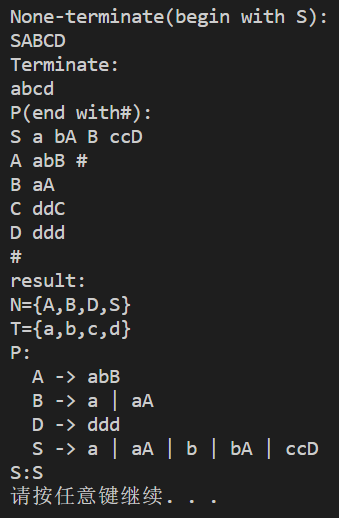
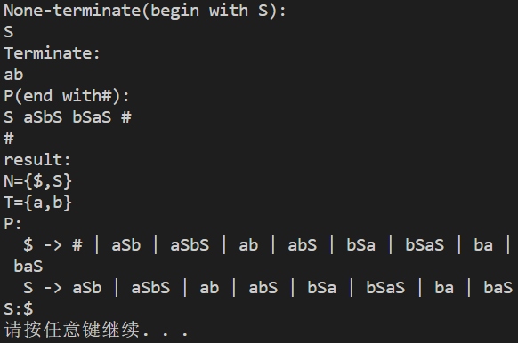
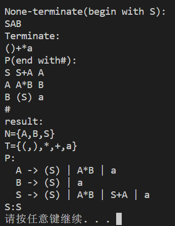

# **设计上下文无关文法的变换算法-实验报告**

### 实验目的

编程实现上下文无关文法的变换算法，用于消除文法中的ε产生式、单产生式、以及无用符号。 程序的输入是一个上下文无关文法，输出是与该文法等价的没有ε产生式、单产生式、无用符号的上下文无关文法。


### 成员与分工

```
隐去
```

### 实验环境

OS:Windows10

语言:C++

编译器:g++ (x86_64-win32-seh-rev0, Built by MinGW-W64 project) 8.1.0


### 输入/输出格式

输入的第一行:非终结符集合,以起始符开头

输入的第二行:终结符集合

接下来的若干行:每一行代表一个产生式,第一个字符表示产生式左侧的非终结符,**ε用#表示**

接下来一行:一个#号,表示输入结束

例如,对于下面的一个文法:

```
S→a|bA|B|ccD
A→abB|ε
B→aA
C→ddC
D→ddd
```

其输入格式为(不含提示语句):

```
None-terminate(begin with S):
SABCD
Terminate:
abcd
P(end with#):
S a bA B ccD
A abB #
B aA
C ddC
D ddd
#
```

输出格式的含义是显然的:

```
result:
N={A,B,D,S}
T={a,b,c,d}
P:
  A -> abB
  B -> a | aA
  D -> ddd
  S -> a | aA | b | bA | ccD
S:S
```

如果在生成无ε文法时需要加入新的起始符,这个起始符将采用$符号.


### 核心算法

根据提示,对一个CFG依次进行:

1. 消除ε产生式

2. 消除单产生式

3. 消除无用符号

即可.

**消除ε产生式**

为了消除ε产生式,首先要计算可致空符号集.

考虑到可能会存在下面这一类文法:

```
S->a
A->B
B->A
```

若试图从A或B开始进行DFS或BFS检查能否到达ε,算法将无法结束.因此,这里采用的是一种类似于Bellman-Ford的算法:

``` C++
    // 计算可致空符
    std::set<char> n1;
    while (1) {
        int origin_size = n1.size();
        for (auto nt : none_terminate) {	// 遍历非终结符集合
            if (n1.count(nt)) continue;		// 该符号已经判定为可致空
            for (auto pi : produce[nt])		// 遍历该符号的生成式
                if (is_to_empty(n1, pi)) {	// 若生成式含有可致空的,则该符号判定为可致空
                    n1.insert(nt);
                    break;
                }
        }
        if (origin_size == n1.size()) break;
    }
```

之后需要利用此集合计算生成新的P1.对于右侧包含可致空符号的生成式,需要枚举出含有和不含有每一个可致空符号的组合,这一过程通过DFS实现:

```C++
// 该函数返回后,ret内包含了所有的组合
void dfs(const std::set<char> &n1, std::vector<std::string> &ret,
         const std::string &pi, std::string cur, int pos) {
    if (pos == pi.size()) {
        if (!cur.empty()) ret.push_back(cur);
        return;
    }

    if (pi[pos] == '#' || n1.count(pi[pos])) dfs(n1, ret, pi, cur, pos + 1);	// 不含这个可致空符号
    cur.push_back(pi[pos]);
    dfs(n1, ret, pi, cur, pos + 1);		// 包含这个(可致空)符号
}

```

最后,若S在第一步中也被判定为可致空符号,则需要产生新的起始符,我们的程序将指定$符号为新的起始符,这一过程较为简单,不再赘述.

**消除单产生式**

为了消除单产生式,对于每一个非终结符需要计算其通过单产生式可推出的非终结符的集合.我们使用了BFS来完成.之后构造了P1.

```C++
    std::map<char, std::set<std::string>> p1;
    std::map<char, std::set<char>> ni;
    for (auto nt : none_terminate) {
        std::queue<char> q;
        q.push(nt);
        while (!q.empty()) {
            char cur = q.front();
            q.pop();
            ni[nt].insert(cur);
            for (auto pi : produce[cur])
                if (is_unitp(pi) && !ni[nt].count(pi[0])) q.push(pi[0]);
        }

        // construct new p1
        for (auto ni_nt : ni[nt])
            for (auto pi : produce[ni_nt])
                if (!is_unitp(pi)) p1[nt].insert(pi);
    }

    produce = p1;
```

**消除无用符号**

这一过程需要依次进行:

- 计算生成符号集合

首先将终结符加入到生成符号集合中,之后遍历并检查非终结符,同样使用一种类似于Bellman-Ford的算法.

```C++
    // 计算生成符号集合
    std::set<char> summon(terminate);
    while (1) {
        int origin_size = summon.size();
        for (auto nt : none_terminate) {			// 遍历非终结符集合
            if (summon.count(nt)) continue;
            for (auto pi : produce[nt])
                if (is_summon_able(summon, pi)) {	// 该产生式是可生成的
                    summon.insert(nt);				// 说明该终结符是可生成的
                    break;
                }
        }
        if (origin_size == summon.size()) break;
    }
```

- 删除非生成符号及相关产生式

```C++
    // p1是删除非生成符号后的产生式
    std::map<char, std::set<std::string>> p1;
    std::set<char> nt1;
    for (auto nt : none_terminate) {
        if (!summon.count(nt)) continue;	// 非生成符号被删除
        nt1.insert(nt);
        for (auto pi : produce[nt])			// 生成符号的可生成的产生式被加入到P1
            if (is_summon_able(summon, pi)) p1[nt].insert(pi);
    }

    produce = p1;
    none_terminate = nt1;
```

- 计算可达符号

从起始符开始,进行BFS,能够到达的就是可达符号.

```C++
    // 计算可达符号集合
    std::set<char> reach;
    std::set<char> t1;
    nt1.clear();

    std::queue<char> q;
    q.push(starter);
    while (!q.empty()) {
        char cur = q.front();
        q.pop();
        reach.insert(cur);
        if (!none_terminate.count(cur)) continue;

        for (auto pi : produce[cur])	// 对于一个可达符号,它的产生式中的每一个符号都是可达的
            for (auto c : pi)
                if (!reach.count(c)) q.push(c);
    }
    for (auto c : reach)	// 可达符号中同时包含终结符与非终结符,对他们进行分类
        if (none_terminate.count(c))
            nt1.insert(c);
        else
            t1.insert(c);

    none_terminate = nt1;
    terminate = t1;
```

- 删除非可达符号及相关产生式

只需要遍历原先的产生式集合,删除不满足条件的产生式即可.

```C++
    p1.clear();
    for (auto nt : none_terminate) {
        for (auto pi : produce[nt]) {
            bool good = true;
            for (auto c : pi)
                if (!terminate.count(c) && !none_terminate.count(c)) {	// 该产生式含非可达符号,删除之
                    good = false;
                    break;
                }
            if (good) p1[nt].insert(pi);
        }
    }

    produce = p1;
```


### 测试

第一组:题目中给出的样例

```
S->a|bA|B|ccD
A->abB|ε
B->aA
C->ddC
D->ddd
```



第二组:

这一组数据主要用以测试消去ε产生式.

比较意外的是,$->S被当作单产生式在后续算法中被转化了,不过根据定义分析后我们认为这是一种正确的行为.

```
S->aSbS|bSaS|ε
```



第三组:

这一组数据主要用以测试消去单产生式

```
S->S+A|A
A->A*B|B
B->(S)|a
```

