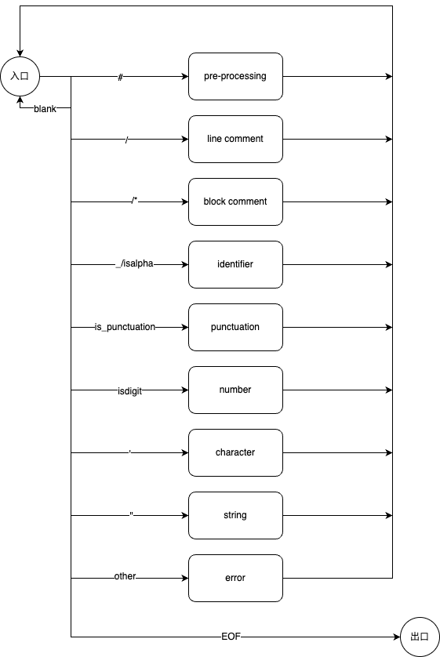

# 词法分析程序的设计与实现

### 实验要求

选定源语言,设计并实现一个词法分析程序,使其具有如下功能:

- 识别出用源语言编写的源程序中的每个单词符号,并以记号的形式输出
- 识别并跳过源程序中的注释
- 统计源程序中的语句行数,各类单词的个数,以及字符总数,并输出统计结果
- 检查并报告源程序中的词法错误,并进行适当的恢复使词法分析可以继续进行

### 程序设计说明

选定C++作为实现语言,设计并实现C语言词法分析器.

##### 输入输出

使用一个文件作为输入,封装C++的文件I/O库,抽象出getchar()和next_char()方法分别用于读取下一个字符和超前扫描.

创建一个添加了".out"作为后缀的文件作为输出.

例:

```
# 以simple_test.c作为输入程序
$ ./parse simple_test.c
# 输出的结果存储于simple_test.c.out
$ cat ./simple_test.c.cout
Total lines: 13
Total characters: 229

|---------------Symbols---------------|
main
argc
argv
...
```

- 统计行数和字符数输出
- 以`<记号,属性>`的格式输出记号,并且输出记号的统计信息
- 符号会被加入到符号表中分离输出
- 将检测到的所有注释内容分离输出
- 检测到错误时,输出错误所在的行号并给出错误类型

具体格式参见"测试"部分

##### 分析过程

词法分析部分主要由一个循环构成,在读取输入文件的过程中,当发现当前的输入符合特定的模式时,进入相关的记号分析自动机,该自动机继续读取输入文件直到输出一个记号或者错误.

状态转换图:



##### 支持词法

可识别C语言中常见的词法,包括:

1. 大部分关键字和所有的符号

```C
const std::string reserve[]{
    "break",    "case",   "char",     "const",  "continue", "default", "do",
    "double",   "else",   "enum",     "extern", "float",    "for",     "goto",
    "if",       "inline", "int",      "long",   "register", "return",  "short",
    "signed",   "sizeof", "static",   "struct", "switch",   "typedef", "union",
    "unsigned", "void",   "volatile", "while"};

const std::string punctuations[]{
    "[",  "]",  "(",  ")",  "{",  "}",   ".",   "->", "++", "--", "&",   "*",
    "+",  "-",  "~",  "!",  "/",  "%",   "<<",  ">>", "<",  ">",  "<=",  ">=",
    "==", "!=", "^",  "|",  "&&", "||",  "?",   ":",  ",",  ";",  "...", "=",
    "*=", "/=", "%=", "+=", "-=", "<<=", ">>=", "&=", "^=", "|="};

const std::string relops[]{"<", "<=", "==", ">", ">=", "!="};
```

2. 所有的合法标识符,例如:

```C
a
____id_with_underline___
_idwithdigit123_23
```

3. 一些合法的常量,例如:

```C
42
123.312
"Hello"
'h'
```

3. 行注释和块注释

##### 错误检测

可以检测到常见的错误,并继续进行后续的词法分析:

- 小数点位置错误的浮点数
- 引号不成对的字符串或字符
- 不支持的符号,如œ

### 源程序&可执行程序

见同目录下的src文件夹和bin文件夹.

### 测试

测试结果基于macOS 12.5

##### 样例1

输入可以通过编译的代码,包含常见的词法结构,注释,预处理等,用来测试基本功能是否正常.

输入simple_good.c:

```C
// This code compiles

#define SIMPLE_GOOD_C
#include <stdio.h>

int main(int argc, char *argv[]) {
    int a = 1;
    float ______asd123 = 123.456;
    printf("Hello, %d %d", a, ______asd123);
    if (2 == 3) {
        return 0;
    }
    return 1;
}
```

输出simple_good.c.out:

```
Total lines: 13
Total characters: 229

|---------------Symbols---------------|
main
argc
argv
a
1
______asd123
123.456
printf
"Hello, %d %d"
a
______asd123
2
3
0
1


|---------------Tokens----------------|
<int, ->
<id, main>
<(, ->
<int, ->
<id, argc>
<,, ->
<char, ->
<*, ->
<id, argv>
<[, ->
<], ->
<), ->
<{, ->
<int, ->
<id, a>
<assign-op, =>
<constant, 1>
<;, ->
<float, ->
<id, ______asd123>
<assign-op, =>
<constant, 123.456>
<;, ->
<id, printf>
<(, ->
<constant, "Hello, %d %d">
<,, ->
<id, a>
<,, ->
<id, ______asd123>
<), ->
<;, ->
<if, ->
<(, ->
<constant, 2>
<relop, ==>
<constant, 3>
<), ->
<{, ->
<return, ->
<constant, 0>
<;, ->
<}, ->
<return, ->
<constant, 1>
<;, ->
<}, ->

statistics:
constant: 7
id: 8
reserved: 8


|--------------Comments---------------|
// This code compiles


|---------------Errors----------------|


```

##### 样例2

对包含一些错误的输入程序进行词法分析,测试错误检测功能.

输入simple.c:

```C
// This code doesn't compile
////// don't mess with comment ///////
/**
 //   block comment
**/

#include <stdio.h>

int main(int argc, char *argv[]) {
    int a = 1;
    float b = 2., c = 123.321;
    char ch = 'g';
    double ____id_with_underline___;
    long _idwithdigit123_23;
    @ œ  // unknown syntax
    printf("Hello);

    if (a >= b) {
        puts("some errors are handled")
    }

    return 0;
}
```

输出simple.c.out:

```
Total lines: 23
Total characters: 412

|---------------Symbols---------------|
main
argc
argv
a
1
b
c
123.321
ch
'g'
____id_with_underline___
_idwithdigit123_23
printf
a
b
puts
"some errors are handled"
0


|---------------Tokens----------------|
<int, ->
<id, main>
<(, ->
<int, ->
<id, argc>
<,, ->
<char, ->
<*, ->
<id, argv>
<[, ->
<], ->
<), ->
<{, ->
<int, ->
<id, a>
<assign-op, =>
<constant, 1>
<;, ->
<float, ->
<id, b>
<assign-op, =>
<,, ->
<id, c>
<assign-op, =>
<constant, 123.321>
<;, ->
<char, ->
<id, ch>
<assign-op, =>
<constant, 'g'>
<;, ->
<double, ->
<id, ____id_with_underline___>
<;, ->
<long, ->
<id, _idwithdigit123_23>
<;, ->
<id, printf>
<(, ->
<if, ->
<(, ->
<id, a>
<relop, >=>
<id, b>
<), ->
<{, ->
<id, puts>
<(, ->
<constant, "some errors are handled">
<), ->
<}, ->
<return, ->
<constant, 0>
<;, ->
<}, ->

statistics:
constant: 5
id: 13
reserved: 10


|--------------Comments---------------|
// This code doesn't compile
////// don't mess with comment ///////
/**
 //   block comment
**/
// unknown syntax


|---------------Errors----------------|
Line 11: bad punctuation '.'
Line 15: unknowd token: @
Line 15: unknowd token: �
Line 15: unknowd token: �
Line 17: bad ""


```
