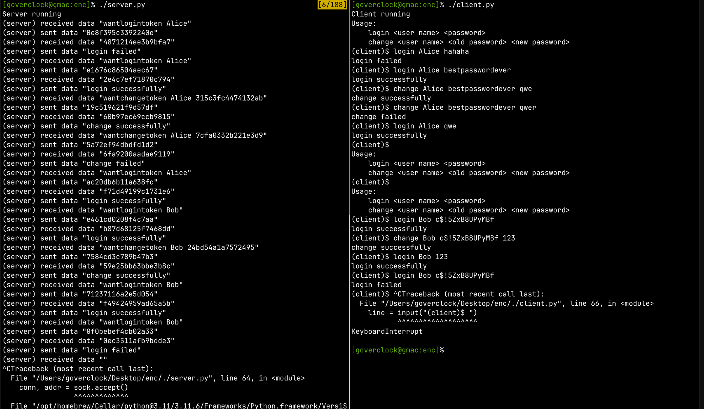

# 信息与网络安全2023

题目4（编程实践）：WEB 系统中用户口令安全防护方案的设计与实现

内容：目前多数 Web 系统采用了基于用户名和口令的身份认证机制，但是公共互联网络环境复杂，如果没有对用户口令进行有效的保护，用户口令将面临窃取、篡改、重放等网络攻击。因此，设计有效的、安全的、方便使用的口令防护方案对于保障 Web 系统中用户认证 信息非常必要。

要求：
1）实现口令验证和口令修改功能
2）口令保护方案需能够抵御重放攻击

---

采用了会话令牌机制来实现对重放攻击的防御,每次会话生成一个随机的令牌,详见[https://zh.wikipedia.org/wiki/重放攻击#关于会话标识符](https://zh.wikipedia.org/wiki/%E9%87%8D%E6%94%BE%E6%94%BB%E5%87%BB#%E5%85%B3%E4%BA%8E%E4%BC%9A%E8%AF%9D%E6%A0%87%E8%AF%86%E7%AC%A6)

编写了`server.py`和`client.py`分别表示服务器和客户端,在两个窗口中运行,支持登陆(口令验证)和修改密码(口令修改)功能.因为没有实现注册功能,账户数据已事先存储在服务器上.

运行示例:

