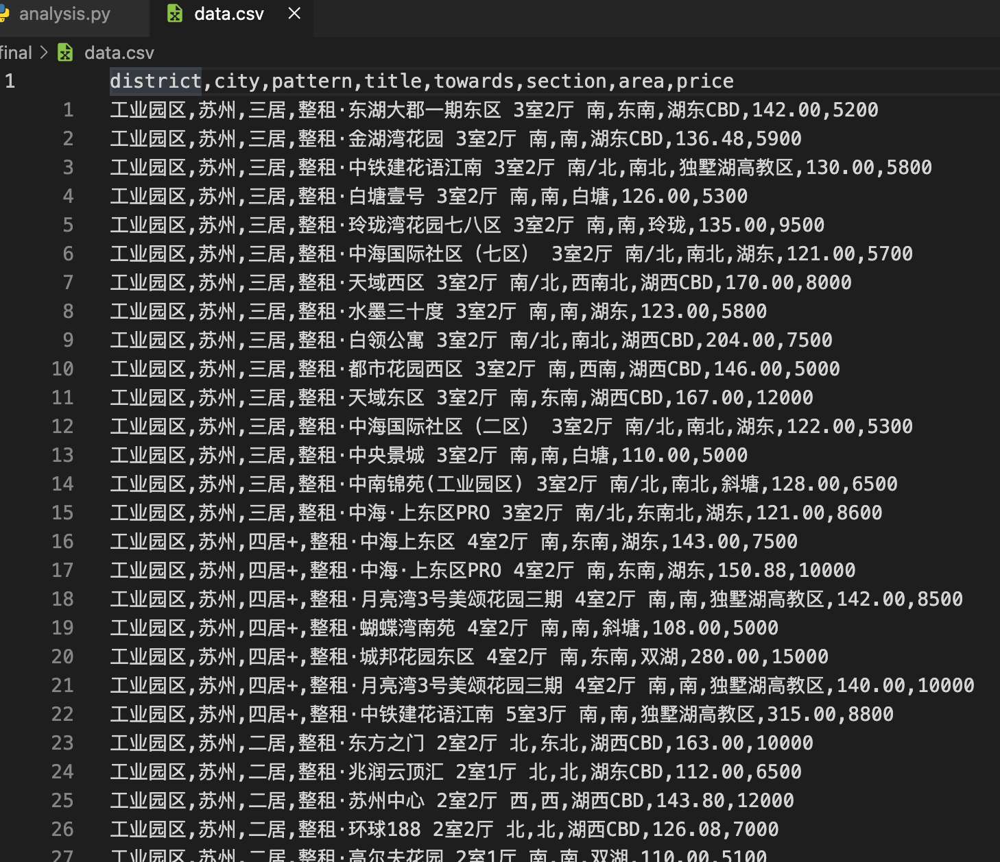
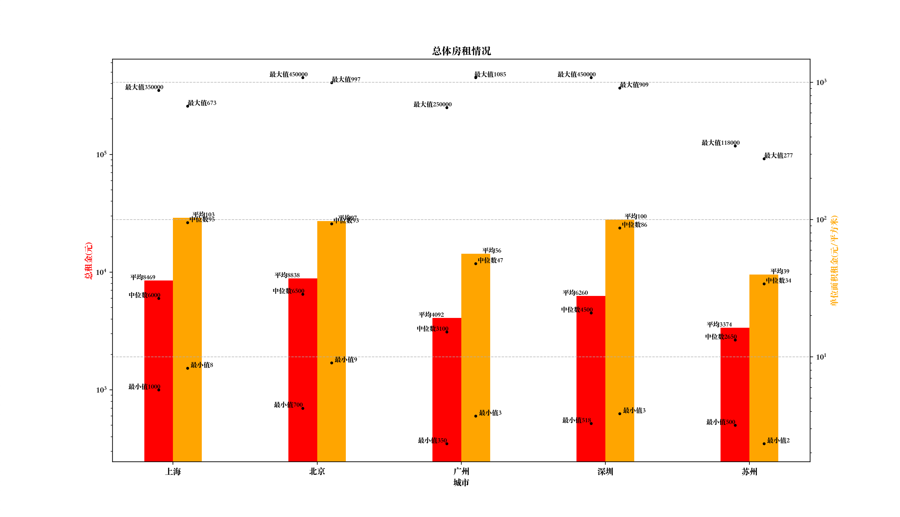
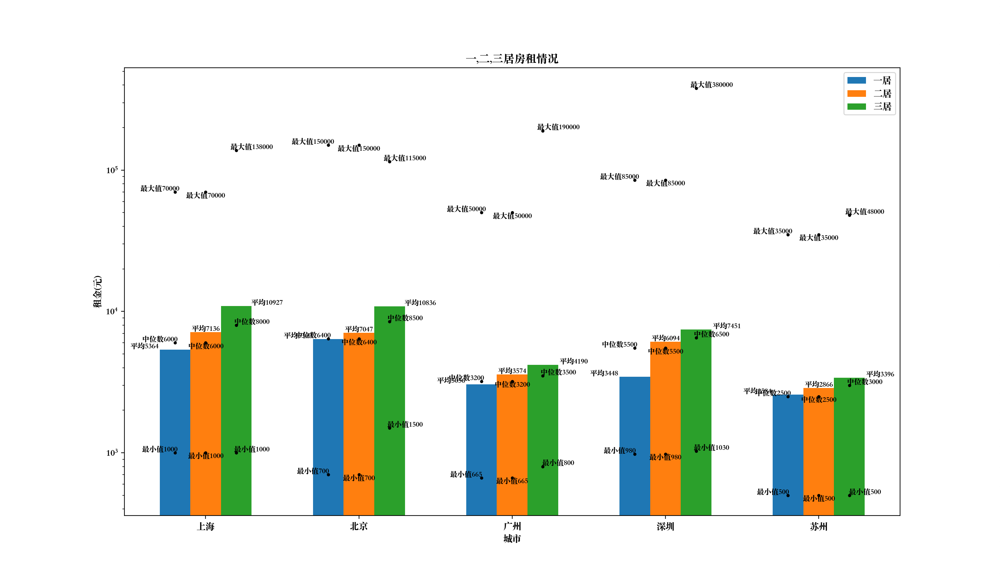
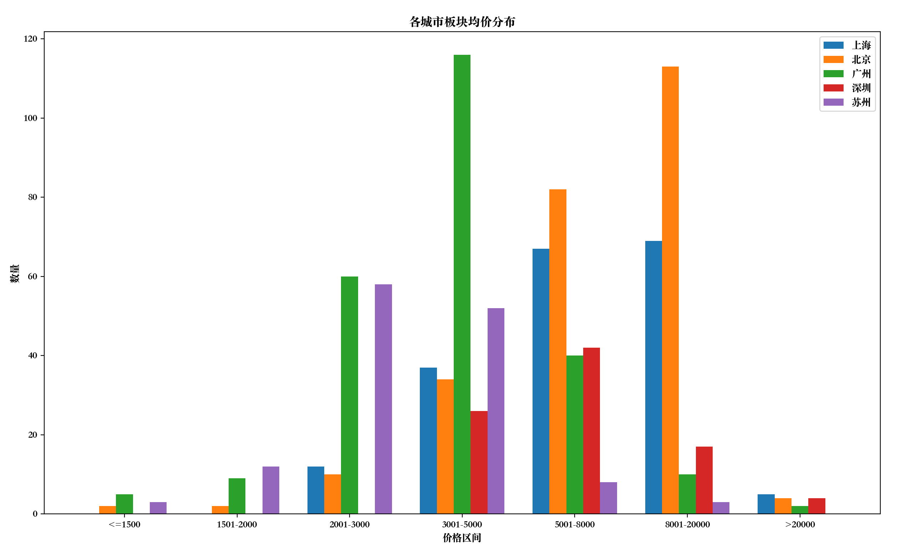
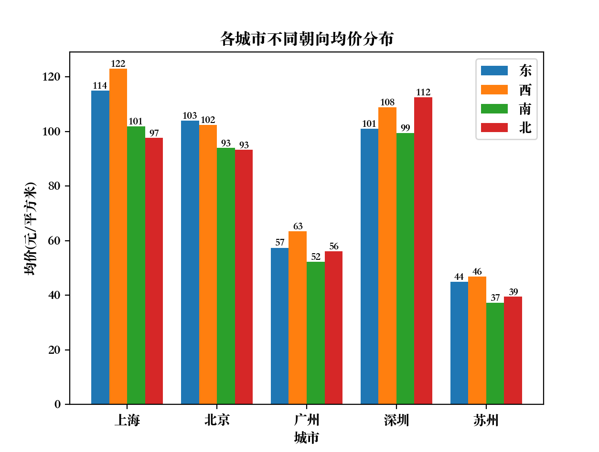

# 2022 Python 程序设计大作业：租房数据分析

1. 要求抓取链家官网北上广深 4 个一线城市，再加上一个离你家乡最近的一个
非一线城市/或者你最感兴趣的一个城市的租房数据。

2. 应获取每个城市的全部租房数据（一线城市的数据量应该在万的数量级）。

3. 比较 5 个城市的总体房租情况，包含租金的均价、最高价、最低价、中位数
等信息，单位面积租金（元/平米）的均价、最高价、最低价、中位数等信息。
采用合适的图或表形式进行展示。

4. 比较 5 个城市一居、二居、三居的情况，包含均价、最高价、最低价、中位
数等信息。

5. 计算和分析每个城市不同板块的均价情况，并采用合适的图或表形式进行展
示。
例如上图中的“海淀-四季青-五福玲珑居北区”，“四季青”即为板块名称。

6. 比较各个城市不同朝向的单位面积租金分布情况，采用合适的图或表形式进
行展示。哪个方向最高，哪个方向最低？各个城市是否一致？如果不一致，
你认为原因是什么？

7. 查询各个城市的人均 GDP，分析并展示其和单位面积租金分布的关系。相对
而言，在哪个城市租房的性价比最高？

8. 查询各个城市的平均工资，分析并展示其和单位面积租金分布的关系。相对
而言，在哪个城市租房的负担最重？

9. 请贴上爬虫程序的核心代码、数据处理及数据展示的核心代码（应有足够的
注释）。

10. 以 pdf 格式提交到教学云平台上，文件名为学号，总页数不超过 30 页。

11. 截止时间 2022 年 12 月 31 日 24 点。

---

### 数据爬取

分析要求后,认为需要获取的信息种类如下:

```python
# items.py

# Define here the models for your scraped items
#
# See documentation in:
# https://docs.scrapy.org/en/latest/topics/items.html

import scrapy

class LianjiaItem(scrapy.Item):
    # define the fields for your item here like:
    # name = scrapy.Field()

    district = scrapy.Field()       # 区域
    city = scrapy.Field()           # 北上广深苏
    pattern = scrapy.Field()        # x居
    towards = scrapy.Field()        # 朝向
    title = scrapy.Field()          # 标题
    section = scrapy.Field()        # 板块
    area = scrapy.Field()           # 面积
    price = scrapy.Field()          # 月租
```

接下来需要到网站上爬取这些数据.我选择的城市是苏州,所以需要爬取北京,上海,广州,深圳和苏州五个城市的共计二十多万条数据.使用scrapy直接爬取数据时会遇到只能爬取前一百页数据(即三千条)的问题,为了解决这个问题利用了网站提供的筛选功能--筛选后的信息数量会减小到100页以内,从而可以爬取.

步骤:

1. 对每个城市的租房信息页面发起请求,从得到的页面中获得该城市的地区列表和价格区间列表
2. 对该城市的地区选项和价格区间选项(一次只选取一个)的组合进行穷举,使得所有组合恰好覆盖该城市的所有租房信息且无重复,对每种筛选条件组合发起请求,从得到的页面中获取这个条件下的租房信息总页数
3. 对上述每一种条件的每一页发起一个请求,获取该页中的所有租房信息

据此,设计了具有三级结构的parse函数:

```python
# spiders/__init__.py

# This package will contain the spiders of your Scrapy project
#
# Please refer to the documentation for information on how to create and manage
# your spiders.

import logging
import scrapy
from lianjia.items import LianjiaItem

class LianjiaSpider(scrapy.spiders.Spider):
    name = 'lianjia'

    item_got = 0
    page_got = 0
    logging.getLogger('scrapy').propagate = False

    cities = ['bj', 'sh', 'gz', 'sz', 'su']  # 北京, 上海, 广州, 深圳, 苏州
    patterns = ['l0', 'l1', 'l2', 'l3']      # 一居, 二居, 三居, 四居+

    start_urls = []
    for c in cities:
        start_urls.append("https://"+c+".lianjia.com/zufang/")

    # 第一级parse,获取一个城市的地区列表和价格区间数量
    # 输入: 例如 北京 https://bj.lianjia.com/zufang/
    def parse(self, response):
        district = []
        district_path = "/html/body/div[3]/div[1]/div[4]/div[1]/ul[2]/*"
        for district_ul in response.xpath(district_path):
            text = district_ul.xpath(".//a/text()").extract()[0]
            pinyin = district_ul.xpath(".//a/@href").extract()[0][8:-1]
            if text == "不限":
                continue
            district.append([text, pinyin])

        priceRange = []
        pr_path = '//*[@id="filter"]/ul[6]/*'
        pr_cnt = len(response.xpath(pr_path)) - 2
        for i in range(1, pr_cnt + 1):
            priceRange.append('rp' + str(i))

        # 根据 地区,价格区间,户型 三个条件筛选后的URL分别爬取
        for d in district:
            for pr in priceRange:
                for p in self.patterns:
                    # https://bj.lianjia.com/zufang/chaoyang/l1rp7/
                    url = response.request.url + d[1] + "/" + p + pr
                    yield scrapy.Request(
                        url,
                        callback=self.parse2,
                        meta={
                            'city': response.request.url[8:10],
                            'district': d[0],
                            'pattern': p,
                            'pr': pr
                        }
                    )

    # 第二级parse,在已经确定了地区和价格区间的页面中获取租房信息页数,并对每一页进行爬取
    # 输入: 例如 北京(bj) 朝阳(chaoyang) 两居(l1) >=20000元(rp7) https://bj.lianjia.com/zufang/chaoyang/l1rp7/
    def parse2(self, response):
        # ti = response.css('span.content__title--hl').xpath('.//text()').extract()[0]
        # self.item_got += int(ti)
        # self.page_got += 1
        # print(self.page_got, ti, self.item_got)
        # with open('fuck.txt', 'a') as f:
        #     f.writelines(f"{response.request.url}, {self.page_got}, {ti}, {self.item_got}\n")
        # return
        
        # 获取此筛选条件下的总页数
        cp = response.css('div.content__pg').xpath(".//@data-totalpage")
        tot_page = 0
        if len(cp):
            tot_page = int(cp.extract()[0])

        # 如果页数为0,说明没有租房信息
        if tot_page > 0:
            for i in range(1, tot_page + 1):
                url = response.request.url
                x = response.request.url.rfind('/') + 1
                # https://bj.lianjia.com/zufang/xicheng/pg2l1rp6/
                url = url[:x] + 'pg' + str(i) + url[x:]
                yield scrapy.Request(
                    url,
                    callback=self.parse3,
                    meta=response.meta
                )

    # 第三级parse,在已经确定了筛选条件和页面的界面中获取实际的租房信息
    def parse3(self, response):
        city_dict = {
            'bj': '北京',
            'sh': '上海',
            'gz': '广州',
            'sz': '深圳',
            'su': '苏州'
        }
        pattern_dict = {
            'l0': '一居',
            'l1': '二居',
            'l2': '三居',
            'l3': '四居+'
        }
        item = LianjiaItem()
        item['district'] = response.meta.get('district')
        item['city'] = city_dict[response.meta.get('city')]
        item['pattern'] = pattern_dict[response.meta.get('pattern')]

        content_list = response.xpath(
            "/html/body/div[3]/div[1]/div[5]/div[1]/div[1]/*")

        found = 0
        for content_item in content_list:       # 处理每条租房信息
            found += 1

            tit = content_item.xpath(".//a/@title").extract()[0]   # 标题
            desc = content_item.xpath(
                ".//div/p[2]/a[2]/text()").extract()  # 板块
            sec = ''
            if desc != []:
                sec = desc[0]
            area = -1
            t = content_item.css('p.content__list--item--des').xpath('.//text()').extract()
            for s in t:
                if '㎡' in s:
                    s = s.replace(" ", '').strip('\n').strip('㎡')
                    if '-' in s:        # 一些租房信息使用形如20.00㎡-30.00㎡的方式表示面积
                        x = s.rfind('-')    # 这种情况取区间的中值作为代表
                        lv = float(s[0:x])
                        rv = float(s[x + 1:])
                        area = (lv + rv) / 2
                    else:
                        area = s
                    
            t = content_item.xpath(
                ".//div/span/em/text()").extract()[0]   # 价格
            if '-' in t:            # 同面积的情况
                x = t.rfind('-')
                lv = float(t[0:x])
                rv = float(t[x + 1:])
                price = (lv + rv) / 2
            else:
                price = t

            item['title'] = tit
            to = ''
            for dir in ['东', '西', '南', '北']:
                if dir in tit:
                    to += dir
            item['towards'] = to
            item['section'] = sec
            item['area'] = area
            item['price'] = price
            yield (item)

        self.item_got += found
        self.page_got += 1
        print("page crawled:", self.page_got, "items(current page):", found, "items(total)",self.item_got)
```


### 数据处理与可视化

爬虫获取的数据如下:



首先对数据进行基本的处理,包括去重,剔除异常数据,预先计算均价:

```python
# analysis.py

# 设置字体
plt.rcParams['font.sans-serif'] = ['Songti SC']

# 读取数据
df = pd.read_csv("data.csv")

# 去重
df = df[['district', 'city', 'pattern', 'title', 'towards',
         'section', 'area', 'price']].drop_duplicates()

# 计算每个条目的单位面积租金
df['price-per-area'] = df['price'] / df['area']

# 剔除异常数据:
# 1. 面积超过1000平方米者
# 2. 单位面积租金小于一元者
tar = df[(df['price-per-area'] <= 1) | (df['area'] > 1000)].index
df.drop(tar, inplace=True)
```

数据分析处理的完整代码(包括绘制下面的图像的部分)置于报告末尾.


##### 总体房租情况(task1)



图中柱形表示平均值,点表示最大值,最小值,中位数.由于总租金与单位面积租金相差很多,两者分别采用了自己的纵轴,且均使用对数模式.

从图中可以看出来:

- 最大值-平均值之间的距离和平均值-最小值之间的距离相近,然而由于这是对数模式,这意味着最大值十分极端

- 在所有城市中,中位数都是略低于平均值的,这说明租金低于平均值的房源更多
- 苏州的租金总体上低于四个一线城市

结合这三点可以得出一个印象:一线城市中存在大量的一般性的房源和少量高价房源,而这些高价房源的价格与一般的房源之间存在着巨大的价格差距,以至于把平均值拉高到比中位数多一至两千元.

这种印象在苏州这种非一线城市明显减弱了很多,几乎所有数据都排名最后.


##### 一居,二居,三居情况(task2)



图中柱形表示平均值,点表示最大值,最小值,中位数.纵轴使用对数模式.

从图中可以看出来:

- 居室越多,价格越贵,在平均值上的差距一般不超过三千元
- 居室数量和最低价没有明显的相关性,但最高价一般为多居室(只有北京是例外)


##### 不同板块的均价情况



图中每个柱形表示一个城市中有多少个板块的均价位于该柱形表示的区间内.

从图中可以看出来:

- 对于每个单独的城市,其分布都符合正态分布
- 北京的峰值出现的地方最靠右,苏州的峰值出现的地方最靠左,符合这两个城市的发展水平


##### 不同朝向的单位面积租金分布情况



从图中可以看出来:

- 朝向西的租金普遍较高
- 上海受到朝向的的影响较大,这可能和当地气候有关


##### 人均GDP与单位面积租金的关系

```
2021 各城市人均GDP
北京 106497
上海 103796
广州 136188
深圳 157985
苏州 136702
```

结合前面的总体房租情况统计数据,GDP/单位面积租金均价的关系(也就是租房性价比的关系)为 苏州>深圳> 广州>北京>上海.

在苏州租房的性价比最高.


##### 平均工资与单位面积租金的关系

```
2021 各城市平均工资
北京 7.5万元
上海 7.8万元
广州 6.89万元
深圳 7.08万元
苏州 6.82万元
```

结合前面的总体房租情况统计数据,平均工资/单位面积租金均价的关系(也就是租房负担的反向关系)为苏州> 广州>北京>上海>深圳.

在深圳租房的负担最重.


### 数据处理完整代码

```python
# analysis.py

from matplotlib import ticker
import pandas as pd
import numpy as np
import matplotlib.pyplot as plt

# 1. 比较 5 个城市的总体房租情况，包含租金的均价、最高价、最低价、中位数
# 等信息，单位面积租金（元/平米）的均价、最高价、最低价、中位数等信息。
# 采用合适的图或表形式进行展示。
def task1():
    # 计算单位面积租金和总租金的均价,最高价,最低价,中位数
    ave = df.groupby('city', as_index=True)['price'].mean()
    ave_per = df.groupby('city', as_index=True)['price-per-area'].mean()
    top = df.groupby('city', as_index=True)['price'].max()
    top_per = df.groupby('city', as_index=True)['price-per-area'].max()
    bot = df.groupby('city', as_index=True)['price'].min()
    bot_per = df.groupby('city', as_index=True)['price-per-area'].min()
    mid = df.groupby('city', as_index=True)['price'].median()
    mid_per = df.groupby('city', as_index=True)['price-per-area'].median()

    # 绘制单位面积租金和总租金的柱状图
    fig, ax1 = plt.subplots()
    ax1.set_title("总体房租情况")
    ax1.set_xlabel('城市')
    ax1.set_ylabel('总租金(元)', color='r')
    ax1.set_yscale('log')

    ax2 = ax1.twinx()
    ax2.set_ylabel('单位面积租金(元/平方米)', color='orange')
    ax2.set_yscale('log')

    x = np.arange(0, len(ave.index))
    plt.xticks(x, ave.index)

    # 柱(平均值)
    ax1.bar(x-0.1, ave, width=0.2, color='r')
    ax2.bar(x+0.1, ave_per, width=0.2, color='orange')
    for a, y in zip(x, ave):
        ax1.text(a-0.21, y, '平均%d' % y, ha='center', va='bottom', fontsize=8)
    for a, y in zip(x, ave_per.values):
        ax2.text(a+0.21, y, '平均%d' % y, ha='center', va='bottom', fontsize=8)

    # 点(最大,最小,中位数)
    ax1.scatter(x-0.1, top, color='black', s=6)
    ax1.scatter(x-0.1, bot, color='black', s=6)
    ax1.scatter(x-0.1, mid, color='black', s=6)
    for a, y in zip(x, top):
        ax1.text(a-0.2, y, '最大值%d' % y, ha='center', va='bottom', fontsize=8)
    for a, y in zip(x, bot):
        ax1.text(a-0.2, y, '最小值%d' % y, ha='center', va='bottom', fontsize=8)
    for a, y in zip(x, mid):
        ax1.text(a-0.2, y, '中位数%d' % y, ha='center', va='bottom', fontsize=8)

    ax2.scatter(x+0.1, top_per, color='black', s=6)
    ax2.scatter(x+0.1, bot_per, color='black', s=6)
    ax2.scatter(x+0.1, mid_per, color='black', s=6)
    for a, y in zip(x, top_per):
        ax2.text(a+0.2, y, '最大值%d' % y, ha='center', va='bottom', fontsize=8)
    for a, y in zip(x, bot_per):
        ax2.text(a+0.2, y, '最小值%d' % y, ha='center', va='bottom', fontsize=8)
    for a, y in zip(x, mid_per):
        ax2.text(a+0.2, y, '中位数%d' % y, ha='center', va='bottom', fontsize=8)
    plt.grid(True, linestyle='--', alpha=0.8)       # 网格线

    plt.show()

# 2. 比较 5 个城市一居、二居、三居的情况，包含均价、最高价、最低价、中位
# 数等信息。
def task2():
    # 计算一居,二居,三居的均价,最高价,最低价,中位数   
    ave = df[df['pattern'] != '四居+'].groupby([ 'city', 'pattern' ], as_index=True)['price'].mean()
    top = df[df['pattern'] != '四居+'].groupby([ 'city', 'pattern' ], as_index=True)['price'].max()
    bot = df[df['pattern'] != '四居+'].groupby([ 'city', 'pattern' ], as_index=True)['price'].min()
    mid = df[df['pattern'] != '四居+'].groupby([ 'city', 'pattern' ], as_index=True)['price'].median()

    fig, ax = plt.subplots()
    ax.set_title("一,二,三居房租情况")
    ax.set_xlabel('城市')
    ax.set_ylabel('租金(元)')
    ax.set_yscale('log')

    x = np.arange(0, len(ave.index.levels[0]))
    plt.xticks(x, ave.index.levels[0].values)
    
    # 柱(平均值)
    ax.bar(x-0.2, ave.xs('一居', level=1, drop_level=False), width=0.2, label='一居')
    ax.bar(x, ave.xs('二居', level=1, drop_level=False), width=0.2, label='二居')
    ax.bar(x+0.2, ave.xs('三居', level=1, drop_level=False), width=0.2, label='三居')
    plt.legend()
    for a, y in zip(x, ave.xs('一居', level=1, drop_level=False)):
        ax.text(a-0.4, y, '平均%d' % y, ha='center', va='bottom', fontsize=8)
    for a, y in zip(x, ave.xs('二居', level=1, drop_level=False)):
        ax.text(a, y, '平均%d' % y, ha='center', va='bottom', fontsize=8)
    for a, y in zip(x, ave.xs('三居', level=1, drop_level=False)):
        ax.text(a+0.4, y, '平均%d' % y, ha='center', va='bottom', fontsize=8)

    # 点(最大,最小,中位数)
    ax.scatter(x-0.2, top.xs('二居', level=1, drop_level=False), color='black', s=6)
    ax.scatter(x-0.2, bot.xs('二居', level=1, drop_level=False), color='black', s=6)
    ax.scatter(x-0.2, mid.xs('二居', level=1, drop_level=False), color='black', s=6)
    for a, y in zip(x, top.xs('二居', level=1, drop_level=False)):
        ax.text(a-0.3,y,'最大值%d' %y, ha='center', va='bottom', fontsize=8)
    for a, y in zip(x, bot.xs('二居', level=1, drop_level=False)):
        ax.text(a-0.3,y,'最小值%d' %y, ha='center', va='bottom', fontsize=8)
    for a, y in zip(x, mid.xs('二居', level=1, drop_level=False)):
        ax.text(a-0.3,y,'中位数%d' %y, ha='center', va='bottom', fontsize=8)
    
    ax.scatter(x, top.xs('二居', level=1, drop_level=False), color='black', s=6)
    ax.scatter(x, bot.xs('二居', level=1, drop_level=False), color='black', s=6)
    ax.scatter(x, mid.xs('二居', level=1, drop_level=False), color='black', s=6)
    for a, y in zip(x, top.xs('二居', level=1, drop_level=False)):
        ax.text(a,y,'最大值%d' %y, ha='center', va='top', fontsize=8)
    for a, y in zip(x, bot.xs('二居', level=1, drop_level=False)):
        ax.text(a,y,'最小值%d' %y, ha='center', va='top', fontsize=8)
    for a, y in zip(x, mid.xs('二居', level=1, drop_level=False)):
        ax.text(a,y,'中位数%d' %y, ha='center', va='top', fontsize=8)

    ax.scatter(x+0.2, top.xs('三居', level=1, drop_level=False), color='black', s=6)
    ax.scatter(x+0.2, bot.xs('三居', level=1, drop_level=False), color='black', s=6)
    ax.scatter(x+0.2, mid.xs('三居', level=1, drop_level=False), color='black', s=6)
    for a, y in zip(x, top.xs('三居', level=1, drop_level=False)):
        ax.text(a+0.3,y,'最大值%d' %y, ha='center', va='bottom', fontsize=8)
    for a, y in zip(x, bot.xs('三居', level=1, drop_level=False)):
        ax.text(a+0.3,y,'最小值%d' %y, ha='center', va='bottom', fontsize=8)
    for a, y in zip(x, mid.xs('三居', level=1, drop_level=False)):
        ax.text(a+0.3,y,'中位数%d' %y, ha='center', va='bottom', fontsize=8)

    plt.show()

# 3. 计算和分析每个城市不同板块的均价情况，并采用合适的图或表形式进行展示
def task3():
    # 计算每个城市不同板块的均价
    ave = df.groupby([ 'city', 'section' ], as_index=True)['price'].mean()

    # 方法:计算各板块的均价,根据均价统计处处于各价格区间内的板块的数量:
    # <=1500, 1501-2000, 2001-3000, 3001-5000, 5001-8000, 8001-20000, >20000
    xlabs = ['<=1500', '1501-2000', '2001-3000', '3001-5000', '5001-8000', '8001-20000', '>20000']
    fig, ax = plt.subplots()
    ax.set_title("各城市板块均价分布")
    ax.set_xlabel('价格区间')
    ax.set_ylabel('数量')
    x = np.arange(len(xlabs))
    plt.xticks(x, xlabs)
    ind = -2
    for city in ave.index.levels[0].values:
        a = ave[city]
        lvs = [0] * 7
        for v in a:
            if v <= 1500:
                lvs[0] += 1
            elif v <= 2000:
                lvs[1] += 1
            elif v <= 3000:
                lvs[2] += 1
            elif v <= 5000:
                lvs[3] += 1
            elif v <= 8000:
                lvs[4] += 1
            elif v <= 20000:
                lvs[5] += 1
            else:
                lvs[6] += 1
        
        ax.bar(x + ind * 0.15, lvs, width=0.15, label=city)
        ind += 1
        
    plt.legend()
    plt.show()

# 4. 比较各个城市不同朝向的单位面积租金分布情况，采用合适的图或表形式进
# 行展示。
def task4():
    # 计算每个城市不同朝向的单位面积租金的均值
    # ave_per = df.groupby([ 'city', 'towards' ], as_index=True)['price-per-area'].mean()
    ave_dong = df[df['towards'].str.contains("东", na=False)].groupby([ 'city' ], as_index=True)['price-per-area'].mean()
    ave_xi = df[df['towards'].str.contains("西", na=False)].groupby([ 'city' ], as_index=True)['price-per-area'].mean()
    ave_nan = df[df['towards'].str.contains("南", na=False)].groupby([ 'city' ], as_index=True)['price-per-area'].mean()
    ave_bei = df[df['towards'].str.contains("北", na=False)].groupby([ 'city' ], as_index=True)['price-per-area'].mean()

    fig, ax = plt.subplots()
    ax.set_title("各城市不同朝向均价分布")
    ax.set_xlabel('城市')
    ax.set_ylabel('均价(元/平方米)')
    x = np.arange(0, len(ave_dong.index))
    plt.xticks(x, ave_dong.index)

    ax.bar(x-0.3, ave_dong.values, width=0.2, label='东')
    ax.bar(x-0.1, ave_xi.values, width=0.2, label='西')
    ax.bar(x+0.1, ave_nan.values, width=0.2, label='南')
    ax.bar(x+0.3, ave_bei.values, width=0.2, label='北')
    for a, y in zip(x, ave_dong):
        ax.text(a-0.3, y, '%d' % y, ha='center', va='bottom', fontsize=8)
    for a, y in zip(x, ave_xi):
        ax.text(a-0.1, y, '%d' % y, ha='center', va='bottom', fontsize=8)
    for a, y in zip(x, ave_nan):
        ax.text(a+0.1, y, '%d' % y, ha='center', va='bottom', fontsize=8)
    for a, y in zip(x, ave_bei):
        ax.text(a+0.3, y, '%d' % y, ha='center', va='bottom', fontsize=8)

    plt.legend()
    plt.show()

plt.rcParams['font.sans-serif'] = ['Songti SC']
df = pd.read_csv("data.csv")

# 去重
df = df[['district', 'city', 'pattern', 'title', 'towards',
         'section', 'area', 'price']].drop_duplicates()

# 计算每个条目的单位面积租金
df['price-per-area'] = df['price'] / df['area']

# 剔除异常数据:
# 1. 面积超过1000平方米者
# 2. 单位面积租金小于一元者
tar = df[(df['price-per-area'] <= 1) | (df['area'] > 1000)].index
df.drop(tar, inplace=True)

task1()
# task2()
# task3()
# task4()
```

