实际运行效果:

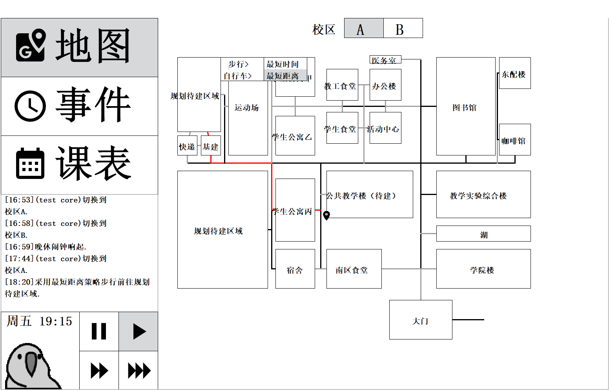

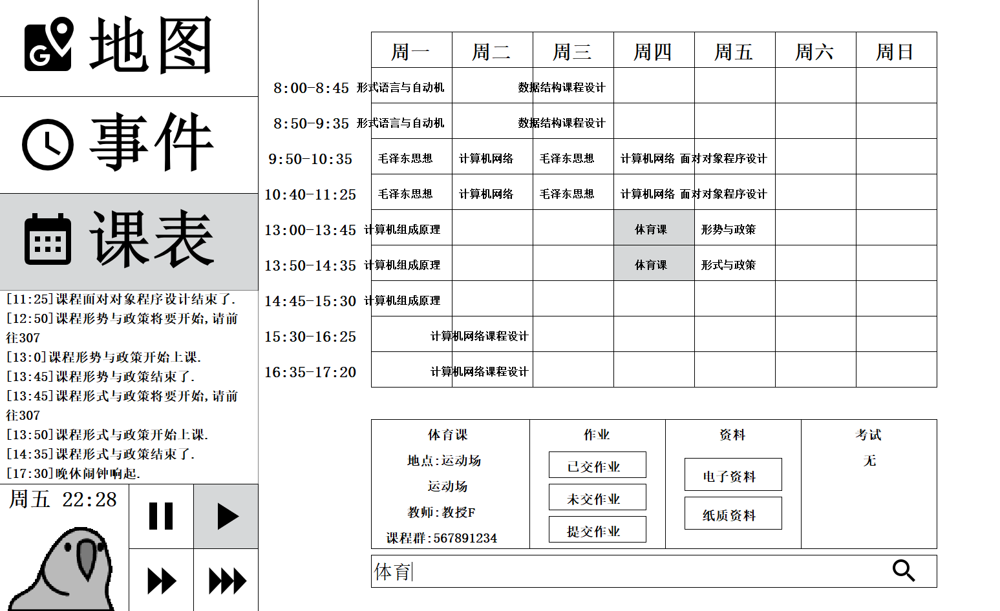

# 鹦鹉课表(student assistant)-用户使用手册

鹦鹉课表是一个线下课程辅助系统,用来帮助学生管理自己的课程及课外活动.具备课程导航功能,课程信息管理和查询功能,以及课外信息管理和查询功能等.每天晚上系统会提醒学生第二天上的课,以及考试的信息;学生可以通过系统管理每门课的学习资料,作业和考试信息;在课外,学 生可以管理自己的个人活动和集体活动信息,可以进行活动时间的冲突检测和闹钟提醒.

### 控制面板

程序的左侧界面是控制面板.包含了:

**模块切换按钮**

即左上方的三个按钮:地图,事件,课表.

点击这三个按钮分别进入相应的功能界面,每个界面都集成了相关的若干小功能.详细介绍见本文"功能聚合界面"部分.

**信息输出窗口**

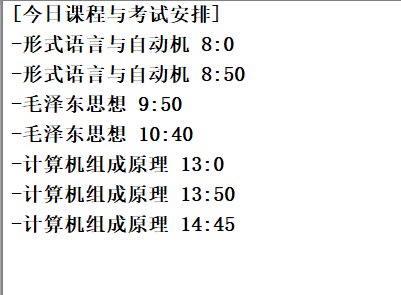

位于中部的是一个信息输出窗口,当发生特定事件时将会通过该窗口提醒用户.这包括:

- 在上课前十分钟或者五分钟,将通知课程即将开始并显示上课地点

- 上课通知

- 下课通知

- 闹钟通知

- 午休晚修通知

- 课程与考试安排

**时间控制区域**

在信息输出窗口下方是时间控制区域,该区域划分为左右两部分:

- 左半部分:一只鹦鹉,它的摇摆速度对应着时间的流速.顶部是时间与日期
- 右半部分:事件流速控制按钮,点击即可设置为暂停/正常流速/二倍速/三倍速,事件流速将会反映到左半部分鹦鹉的摇摆速度上

### 功能聚合界面

使用控制面板的模块切换按钮后,可以切换至对应的功能聚合界面,这显示在程序的右侧主体界面.

**地图界面**

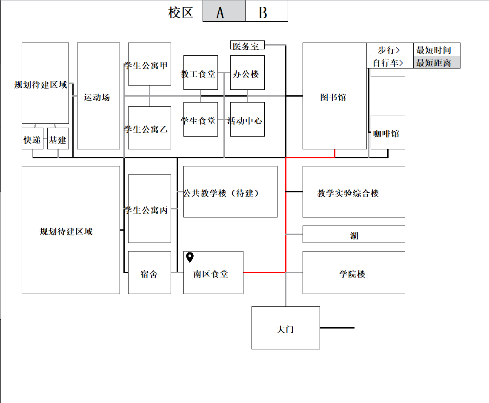

包含校区切换按钮,以及校园地图界面.

- 使用校区切换按钮,可以切换校区至A或B校区,此后校园地图界面将会显示该校区内的建筑物
- 校区地图界面包含了一个校区内的所有建筑物以及路径.自行车道显示为黑色路径,人行道显示为灰色路径

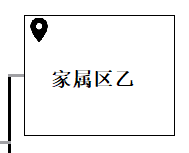

在校区地图界面中,使用上图所示的标志来标识用户所在的建筑物.而当鼠标悬浮于任意建筑物时,将会显示一个包含两级的菜单,用以选择前往该建筑物的方式与策略.

确认策略后,地图计算出最佳路径,用红线标识出来,这一过程也将输出到信息输出窗口:

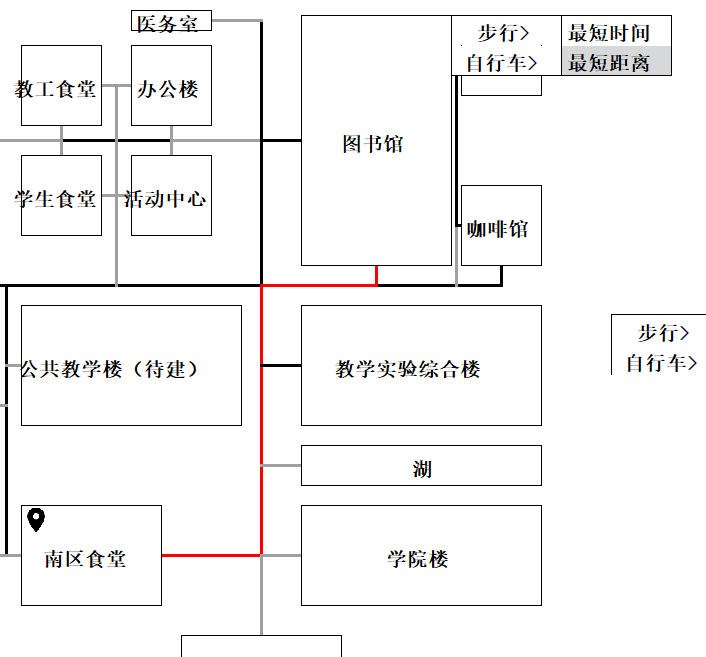

**事件界面**

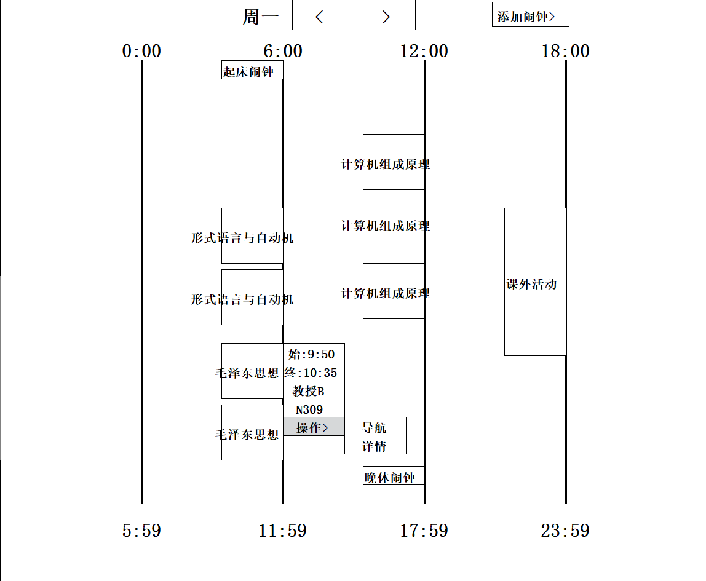

包含时间轴,日期切换按钮和添加闹钟按钮.

- 时间轴显示了选中日期的所有时段上的事件.一个事件的时间越长,在时间轴上占据的距离越大.当鼠标悬浮于某一事件上时,将会显示该事件的相关信息以及一些可执行的操作
- 进入事件界面时默认显示今日的时间轴,使用日期切换按钮可以查看其它日期的时间轴
- 使用添加闹钟按钮,使用鼠标滑轮设置日期,时分后点击确定即可新建闹钟,这个闹钟也将显示在时间轴上

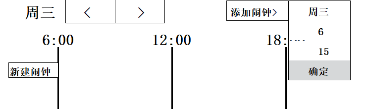

**课表界面**

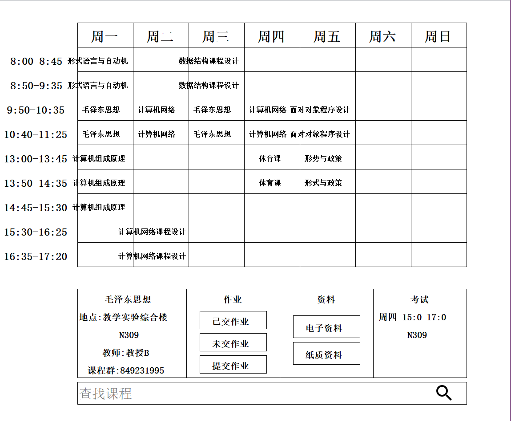

包含课表,信息展示窗口和搜索条.

- 在课表中点击一门课程,就可以在信息展示窗口中查看其相关信息

- 信息展示窗口除了显示课程与考试信息之外,还支持作业与资料管理

  - 点击已交作业,将会弹出窗口显示之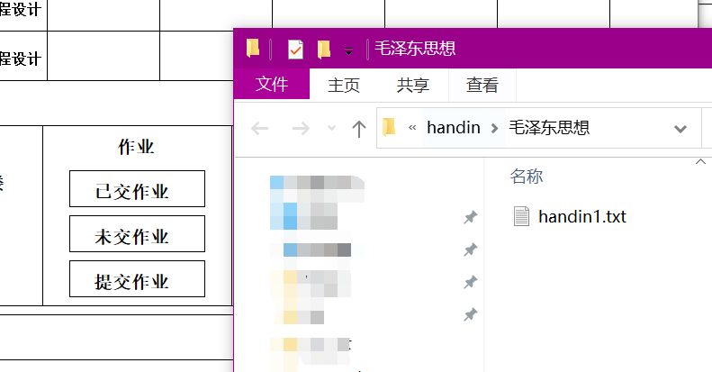

  - 点击未交作业,将会输出未交作业的提示信息,并弹出窗口显示作业要求

  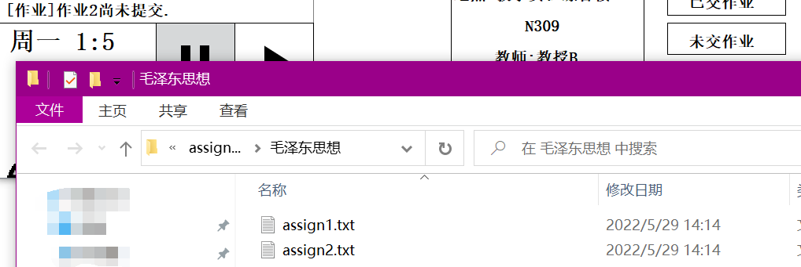

  - 点击提交作业,可以选择作业并提交

- 使用搜索条,可以根据课程名称,教师,上课地点或课程群搜索课程,符合条件的课程将在课表中高亮显示

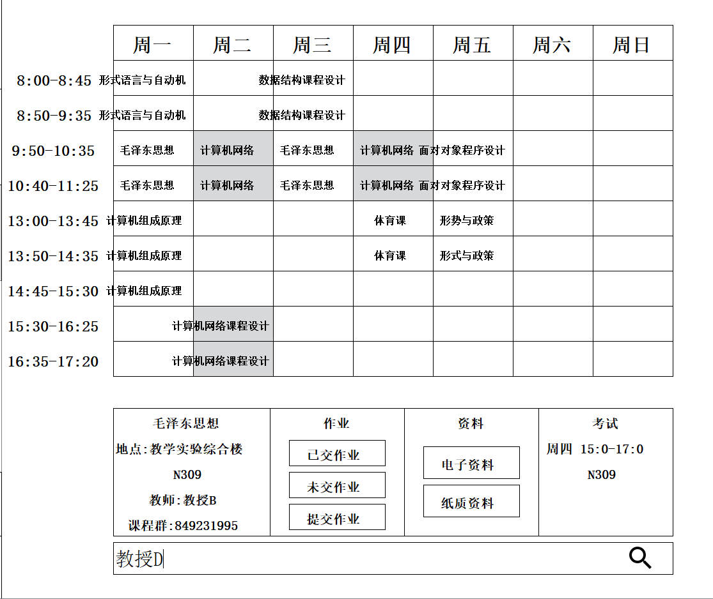

